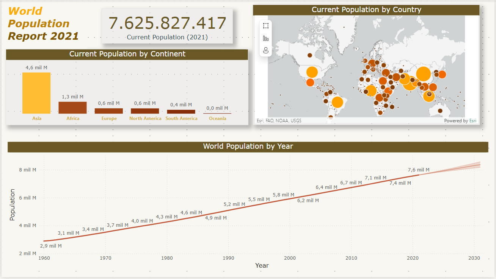

# Forecasting Global Population Trends

## Introduction
This project utilizes Power BI's Forecasting feature to analyze global population trends from 1960 to 2021 and project future growth over the next 10 years. Through advanced predictive analysis, the report provides valuable insights into population dynamics worldwide.

## Steps Overview

1. **Add and Customize a Line Chart:**
   - Load the `WorldPopulation.pbix` file into Power BI.
   - Add a line chart with:
     - **X-axis:** `Year` (without date hierarchy).
     - **Y-axis:** `Population`.
   - Resize the chart and update the title to **World Population by Year**.
   - Use the **Format Painter** tool to style the line chart consistently with the report's visualizations.

2. **Enhance with Forecasting:**
   - Select the line chart and enable the Forecast tool from the Analytics pane.
   - Set the following parameters:
     - Forecast Length: **10 years**.
     - Confidence Interval: **95%**.
   - Apply changes and hover over the forecast line to view insights.

3. **Customize the Forecast Line:**
   - Update the forecast line settings:
     - Change line color to **blue**.
     - Set transparency to **50%**.
     - Adjust the confidence band style to **Line**.
     - Add a tooltip title: **Population Forecast**.

4. **Final Report:**
   - Review and adjust visualizations to align with the report’s overall design.
   - Ensure the forecast adds predictive value and enhances the analysis.

## Key Outcomes
- **Predictive Insights:** Projections for global population trends over the next decade.
- **Interactive Visualizations:** Customizable line chart with forecast and confidence intervals.
- **Actionable Analysis:** Empower decision-making with forecasts based on historical data.

## Visualizations
- Placeholder for the forecast line chart:
  
  

## Conclusion
This project demonstrates Power BI’s Forecasting capabilities to predict global population trends. The resulting report adds a forward-looking perspective to the analysis, providing stakeholders with valuable insights for planning and decision-making.
